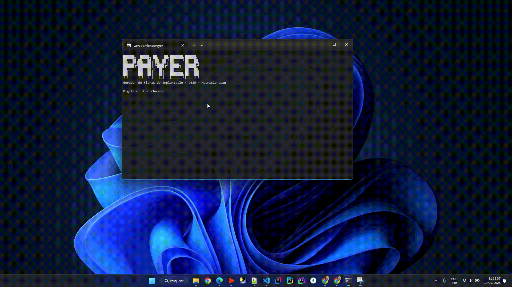

# Gerador de Fichas de Implantação

## Descrição

Este projeto automatiza a criação de fichas de implantação em Excel, extraindo informações de clientes e chamados através da API do TomTicket. O sistema gera planilhas estilizadas com dados organizados e tokens para terminais.

## Motivação

Como Analista de Suporte, uma das responsabilidades da minha equipe é a criação manual das fichas de implantação para cada novo cliente. O processo original consistia em:

1. Acessar o sistema TomTicket.
2. Copiar diversas informações do cliente e do chamado.
3. Colar e formatar os dados em uma planilha modelo.

Embora funcional para uma baixa demanda, este processo manual se tornava lento e suscetível a erros quando o fluxo de novos clientes aumentava.

Este projeto nasceu da necessidade de otimizar essa tarefa. A solução utiliza a API do TomTicket para automatizar completamente o fluxo, desde a coleta dos dados até a geração e o salvamento da planilha final, estilizada e pronta para uso.

**Principais benefícios:**

- Redução drástica do tempo gasto por ficha.
- Eliminação de erros de cópia e colagem manual.
- Padronização garantida de todas as fichas geradas.

Além de resolver um problema prático da área, este projeto foi uma excelente oportunidade para aprofundar meus conhecimentos em desenvolvimento, especialmente em consumo de APIs REST, manipulação de dados e automação de tarefas.

## Como usar

### Opção 1: Baixar a versão pronta (Recomendado)

1. Acesse a [página de Releases](https://github.com/mauricio-luan/gerador-fichas-3.0/releases) do projeto
2. Baixe a versão mais recente (arquivo `.zip`)
3. Extraia o conteúdo em uma pasta de sua preferência
4. Renomeie o arquivo `.env.example` para `.env` e insira seu token

### Opção 2: Build manual

- Baixe a pasta `dist`
- Copie o `env.example` para dentro da dist como `.env`, e insira o token

```env
# Configurações da API TomTicket
API_URL=https://api.tomticket.com/v2.0/customer/details?customer_id=
API_TICKET_URL=https://api.tomticket.com/v2.0/ticket/detail?ticket_id=
API_TOKEN=seu_token_aqui
```

- Execute o programa
  

### Como obter o Token

1. Acesse o painel do TomTicket
2. Vá em Configurações > API
3. Gere um novo token de acesso
4. Copie o token para o arquivo `.env`

**Mauricio Luan** - 2025
